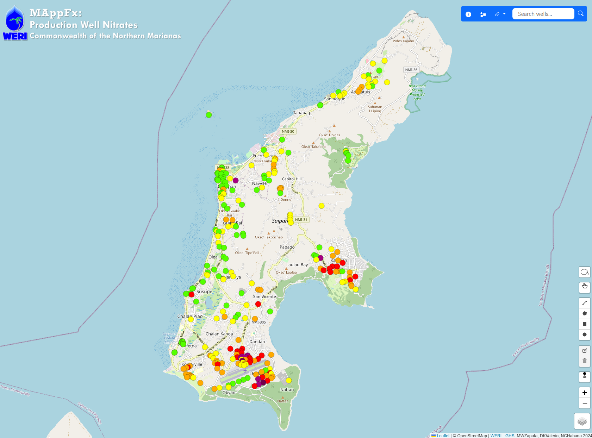

<h1 align="center">MAppFx: Saipan, CNMI - Production Well Nitrates </h1>

<i><b>Figure 1.</b>Preview of map user interface with data points.</i>

## Abstract 

__MAppFx__ is a web page interactive map environment that retrieves an interactive graph of a site upon clicking a map feature object (be it a point, polygon, or a line). WERI Web MAppFx os a product of WERI through the Guam Hydrologic Survey Program (P.L. 24-247) and USGS 104-b, available through the [Guam Hydrologic Survey website](https://guamhydrologicsurvey.uog.edu/).

Data originated from Bureau of Environmental and Coastal Quality's Data Manager and Team. Through a collaborative effort, the GHS Information Management Team created this online data visualization tool to facilitate modern means of data sharing and interagency outreach. The primary focus of this tool is to use nitrates as an indicator of groundwater contamination, making it an essential resource for environmental monitoring.

In terms of future development, the team behind WERI MAppFx plans to further enhance the user interface and user experience, taking into account feedback received during the 2023 CNMI Water Advisory Council Meeting. This includes improvements in identifying well shapes, implementing a color legend, incorporating additional statistics, and providing layers for different islands like Saipan, Tinian, and Rota. The ultimate goal is to seek approval to make this valuable product available for public viewing online, ensuring that it serves as a powerful tool for a wide range of users.

> Keywords: Saipan, CNMI, production wells, nitrates, data visualization, user interface, maps, historical graphs

## WERI Technical Report (coming soon)

The technical report for this project is in progress and will soon be available online through the WERI website's _Reports and Publications_ section [here](https://weri.uog.edu/reports-and-publications/). It will also be available through the Guam Hydrologic Survey website, [here](https://guamhydrologicsurvey.uog.edu/index.php/mappfx/). 

## Authors  & Developers 

D.K. Valerio, M.W. Zapata & N.C. Habana, PhD

## Acknowledgements 

- _Bureau of Environmental and Coastal Quality_ | 
G. Arriola, T. Spaeth & BECQ Team 

- _Brigham Young University's Civil Engineering Department, Hydroinformatics Laboratory_ | R. Hales, G. Williams, PhD & N. Jones, PhD

- _Water & Environmental Research Institute of the Western Pacific_ | 
S. Khosrowpanah, M.A. Lander & B. Whitman 

- _University of Guam's Web Team_ | J. Wiglesworth, M. Raymundo, R. Hidalgo & UOG Web Team 

## MAppFx Library

WERI's collection of MAppFx web apps is available online in the Guam Hydrologic Survey's Library, [here](https://guamhydrologicsurvey.uog.edu/index.php/mappfx/).